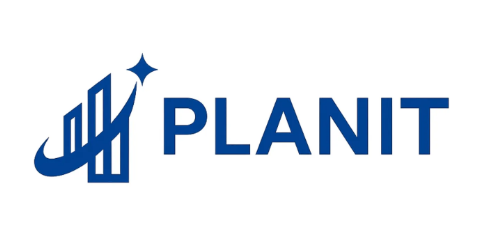
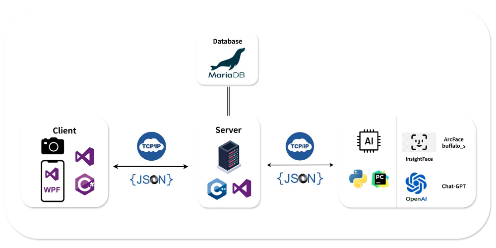

# PLANIT - AI 기반 직업 추천 및 성장 플래너 시스템



## 📋 프로젝트 개요

PLANIT은 AI를 활용한 개인 맞춤형 직업 추천 및 성장 계획 수립 시스템입니다. 사용자의 다양한 데이터를 분석하여 적합한 직업을 추천하고, 목표 달성을 위한 구체적인 성장 플래너를 제공합니다.


## 👥 팀 소개

팀장 : 박서은
팀원 : 고준영, 김대업, 유예솜, 하진영 

## 📅 프로젝트 기간

** 2025년 7월 29일 ~ 8월 12일 **

## 🏗️ 시스템 아키텍처



## MVVM 아키텍처


### 주요 구성 요소

- **C++ TCP 서버**: 클라이언트 요청 처리 및 데이터베이스 연동
- **Python AI 모듈**: 자연어 처리 및 AI 분석 엔진
- **MariaDB**: 사용자 정보 및 분석 결과 저장
- **WPF 클라이언트**: 사용자 인터페이스

## ⚡ 주요 기능

### 1. 사용자 인증
- **일반 로그인** (Protocol 1): ID/PW 기반 인증
- **얼굴 인식 로그인** (Protocol 2): 얼굴 임베딩 벡터를 통한 생체 인증
- **회원가입** (Protocol 4): 얼굴 인식 데이터 포함 계정 생성
- **ID 중복 확인** (Protocol 3): 실시간 아이디 유효성 검사

### 2. AI 기반 직업 분석
- **종합 성격 분석** (Protocol 100): AI를 통한 개인 성향 분석 및 직업 추천
- **희망 직업 검색** (Protocol 100_5): 자연어 기반 직업 검색 및 유사 직업 제안
- **성장 플래너 생성** (Protocol 100_6): 선택한 직업에 맞는 맞춤형 성장 계획 수립

### 3. 성장 관리
- **최신 추천 직업 조회** (Protocol 5): 개인화된 직업 추천 목록 (최대 6개)
- **플래너 정보 조회** (Protocol 9): 현재 진행 중인 성장 계획 및 목표 확인
- **목표 달성 처리** (Protocol 10): 완료된 목표 업데이트 및 진행 상황 관리

### 4. 개인 정보 관리
- **이력서 관리** (Protocol 6, 7): 개인 이력서 작성, 수정, 조회
- **마이페이지** (Protocol 8): 사용자 정보 및 최신 분석 결과 확인

## 🛠️ 기술 스택

### Backend (C++)
- **언어**: C++17
- **네트워킹**: Winsock2 (Windows TCP Socket)
- **JSON 처리**: nlohmann/json
- **데이터베이스**: MariaDB C/C++ Connector

### AI Module (Python)
- **언어**: Python 3.x
- **AI/ML**: 자연어 처리 및 임베딩 기술
- **통신**: TCP Socket 통신

### Database
- **DBMS**: MariaDB
- **주요 테이블**: 
  - `USER_INFO`: 사용자 정보 (얼굴 인식 데이터 포함)
  - `USER_TOTAL_RESULT`: AI 분석 결과
  - `USER_RES_JOBS`: 추천 직업 정보
  - `USER_CV`: 이력서 정보
  - `grown_planner`: 성장 플래너
  - `grown_planner_goal`: 목표 관리

## 📡 프로토콜

### 요청/응답 형식
모든 통신은 다음 형식을 따릅니다:
```
[4바이트 길이][JSON 데이터]
```

### 주요 프로토콜 예시
```json
// 로그인 요청 (Protocol 1_0)
{
  "protocol": "1_0",
  "id": "user123",
  "pw": "password"
}

// AI 분석 요청 (Protocol 100_0_0)
{
  "protocol": "100_0_0",
  "u_id": "user123",
  "analysis_data": "..."
}
```

## 📁 프로젝트 구조

```

planit/
├── RunNow/                           # WPF 클라이언트 애플리케이션
│   ├── Assets/                       # 이미지, 아이콘 등 리소스 파일
│   ├── Behaviors/                    # UI 동작 및 상호작용 정의
│   │   ├── .gitkeep
│   │   ├── AnimatedProgressBarBehavior.cs
│   │   ├── AnswerToColorConverter.cs
│   │   ├── BarWidthAnimationBehavior.cs
│   │   ├── BooleanToVisibilityConverter.cs
│   │   ├── BoolToAlignmentConverter.cs
│   │   ├── BoolToColorConverter.cs
│   │   ├── BoolToTextAlignmentConverter.cs
│   │   ├── BoolToVisibilityConverter.cs
│   │   ├── BoolToVisibilityInverseConverter.cs
│   │   ├── NumberFormatConverter.cs
│   │   ├── RadioCheckedConverter.cs
│   │   ├── StatusToColorConverter.cs
│   │   ├── StringNullOrEmptyToVisibilityConverter.cs
│   │   └── styles (Windows Markup)
│   ├── bin/                          # 빌드된 실행 파일
│   ├── Converters/                   # 데이터 바인딩 변환기
│   │   ├── .gitkeep
│   │   ├── AppConfig.cs
│   │   ├── Constants.cs
│   │   ├── DependencyInjection.cs
│   │   ├── JsonHelper.cs
│   │   ├── NavigationStore.cs
│   │   ├── PasswordBoxHelper.cs
│   │   └── ShareDataService.cs
│   ├── Core/                         # 핵심 비즈니스 로직 및 설정
│   ├── Data/                         # 데이터 접근 계층
│   ├── Models/                       # 데이터 모델 클래스
│   │   ├── .gitkeep
│   │   ├── CareerProfile.cs          # 진로 프로필 모델
│   │   ├── ChatMessage.cs            # 채팅 메시지 모델
│   │   ├── DeepQuestionItem.cs       # 심층 질문 아이템 모델
│   │   ├── Emotion_result_model.cs   # 감정 분석 결과 모델
│   │   ├── EmotionResult.cs          # 감정 결과 모델
│   │   ├── InterestItem.cs           # 관심사 아이템 모델
│   │   ├── QuestionModel.cs          # 질문 모델
│   │   ├── RecommendedJobItem.cs     # 추천 직업 아이템 모델
│   │   └── ScenarioStep.cs           # 시나리오 단계 모델
│   ├── obj/                          # 임시 빌드 파일
│   ├── Services/                     # 서비스 레이어 (API 통신, 비즈니스 로직)
│   ├── ViewModels/                   # MVVM 패턴의 뷰모델
│   │   ├── .gitkeep
│   │   ├── CareerAnalysisViewModel.cs      # 진로 분석 뷰모델
│   │   ├── CertificatePopupViewModel.cs    # 자격증 팝업 뷰모델
│   │   ├── ChatBotViewModel.cs             # 챗봇 뷰모델
│   │   ├── DeepResultViewModel.cs          # 심층 분석 결과 뷰모델
│   │   ├── DeepTestViewModel.cs            # 심층 테스트 뷰모델
│   │   ├── EmotionResultViewModel.cs       # 감정 결과 뷰모델
│   │   ├── EmotionViewModel.cs             # 감정 분석 뷰모델
│   │   ├── FinanceAnalysisViewModel.cs     # 금융 분석 뷰모델
│   │   ├── growth_check_ViewModel.cs       # 성장 체크 뷰모델
│   │   ├── Growth_main_ViewModel.cs        # 메인 성장 뷰모델
│   │   ├── Growth_My_ViewModel.cs          # 개인 성장 뷰모델
│   │   ├── growth_start_ViewModel.cs       # 성장 시작 뷰모델
│   │   ├── LoginViewModel.cs               # 로그인 뷰모델
│   │   ├── MainViewModel.cs                # 메인 뷰모델
│   │   ├── MainViewModel.Map.cs            # 맵 관련 메인 뷰모델
│   │   ├── MainWindowViewModel.cs          # 메인 윈도우 뷰모델
│   │   ├── MapViewModel.cs                 # 맵 뷰모델
│   │   └── MyPageViewModel.cs              # 마이페이지 뷰모델
│   ├── Views/                        # UI 화면 (XAML + Code-behind)
│   │   ├── .gitkeep
│   │   ├── BottomNav.xaml                  # 하단 네비게이션 바
│   │   ├── BottomNav.xaml.cs
│   │   ├── CareerAnalysisView.xaml         # 진로 분석 화면
│   │   ├── CareerAnalysisView.xaml.cs
│   │   ├── CertificatePopup.xaml           # 자격증 팝업
│   │   ├── CertificatePopup.xaml.cs
│   │   ├── ChatBotView.xaml                # 챗봇 화면
│   │   ├── ChatBotView.xaml.cs
│   │   ├── CircularProgress.xaml           # 원형 프로그레스바
│   │   ├── CircularProgress.xaml.cs
│   │   ├── DeepResultView.xaml             # 심층 분석 결과 화면
│   │   ├── DeepResultView.xaml.cs
│   │   ├── DeepTestView.xaml               # 심층 테스트 화면
│   │   ├── DeepTestView.xaml.cs
│   │   ├── EmotionResultView.xaml          # 감정 결과 화면
│   │   ├── EmotionResultView.xaml.cs
│   │   ├── EmotionView.xaml                # 감정 분석 화면
│   │   ├── EmotionView.xaml.cs
│   │   ├── FinanceAnalysisView.xaml        # 금융 분석 화면
│   │   └── FinanceAnalysisView.xaml.cs
│   ├── App.xaml                      # 애플리케이션 진입점
│   ├── App.xaml.cs
│   ├── AssemblyInfo.cs               # 어셈블리 정보
│   ├── README.md                     # 프로젝트 설명 문서
│   ├── RunNow.csproj                 # C# 프로젝트 파일
│   └── RunNow.sln                    # Visual Studio 솔루션 파일
└── server/                           # C++ 백엔드 서버
    ├── parsing_json.cpp              # JSON 요청 파싱 및 프로토콜 라우팅
    ├── db_class.cpp                  # 데이터베이스 연동 및 CRUD 작업
    ├── mid_server.cpp                # TCP 서버 메인 로직 및 네트워킹
    ├── parsing_Json.h                # JSON 파싱 핸들러 클래스 정의
    ├── db_class.h                    # 데이터베이스 클래스 인터페이스
    └── server.h                      # 서버 메인 클래스 정의

***클라이언트 (WPF - C#)***

MVVM 아키텍처: Models, Views, ViewModels로 구조화된 WPF 애플리케이션
주요 기능: 감정 분석, 진로 분석, 챗봇, 금융 분석, 개인 성장 관리
UI 컴포넌트: XAML 기반의 사용자 인터페이스와 데이터 바인딩

***서버 (C++)***

TCP 서버: 클라이언트 요청을 처리하는 네트워크 서버
JSON 통신: 클라이언트와 JSON 프로토콜로 데이터 교환
데이터베이스 연동: 사용자 데이터 및 분석 결과 저장/관리

